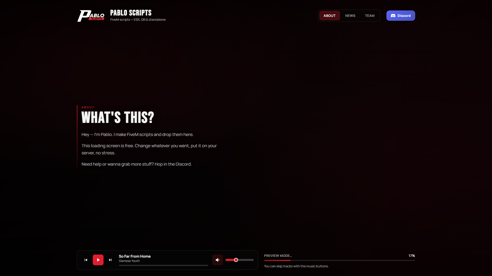
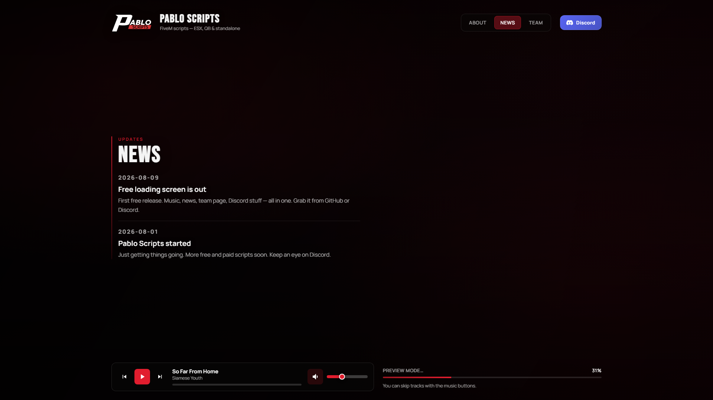
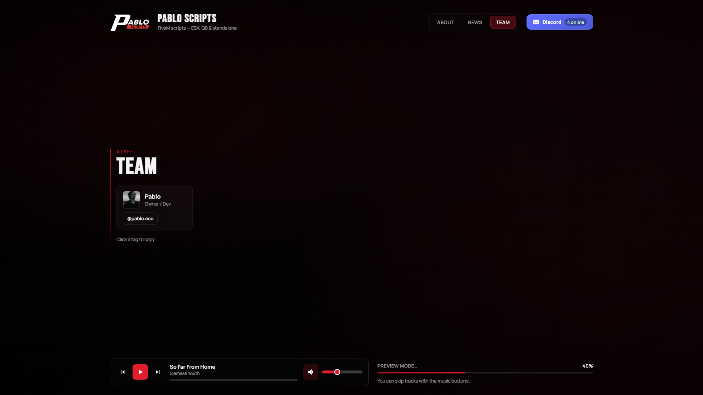

<p align="center">
  
</p>

<h1 align="center">Pablo Loading Screen</h1>

<p align="center">
  Interactive FiveM loading screen with music, news, team page and Discord integration.
</p>

<p align="center">
  <a href="https://fivem.net/"></a>
  
  
  
  <a href="https://discord.gg/xE8EDuG4YS"></a>
</p>

<p align="center">
  
  
  
  
  
  
  
  
  
  
  
  
</p>

---

## Preview

<p align="center">
  
</p>

| About | News | Team |
|:-----:|:----:|:----:|
|  |  |  |

---

## Features

- **About page** — short intro about your project
- **News page** — updates and announcements
- **Team page** — staff list with copyable Discord tags
- **Music player** — play / pause / next / prev, seek, volume, mute
- **Discord button** — invite link + online member count (widget)
- **Background** — static image or video
- **Easy config** — everything in one `config.js`
- **Local fonts** — works offline in FiveM

---

## Installation

1. Download / clone this resource into your server `resources` folder  
2. Rename the folder to `pablo-loadingscreen` (if needed)  
3. Add this to your `server.cfg`:

```cfg
ensure pablo-loadingscreen
```

4. Edit `html/js/config.js`  
5. Restart your server  

> Make sure no other loading screen resource is started at the same time.

---

## Configuration

All settings are in **`html/js/config.js`**.

| Option | Description |
|--------|-------------|
| `serverName` / `tagline` | Header brand text |
| `backgroundType` | `'image'` or `'video'` |
| `backgroundImage` / `backgroundVideo` | Paths under `html/` |
| `about` | About page title + text |
| `news` | News list (`date`, `title`, `text`) |
| `team` | Team list (`name`, `role`, `discordTag`, `avatar`) |
| `discord.inviteUrl` | Discord invite link |
| `discord.guildId` | Server ID for online count |
| `music.tracks` | Music list (`title`, `artist`, `file`) |
| `tips` | Loading tip rotation |

### Background

- Put your image in `html/assets/backgrounds/` and set `backgroundType: 'image'`
- Or use a `.mp4` and set `backgroundType: 'video'`

### Music

1. Drop `.mp3` / `.ogg` files into `html/assets/music/`
2. Add them to `Config.music.tracks`
3. Use **royalty-free** music only

### Discord online count

1. Discord → Server Settings → Widget → Enable  
2. Set an invite channel  
3. Put your Server ID into `discord.guildId`

---

## Resource Structure

```text
pablo-loadingscreen/
├── fxmanifest.lua
├── client.lua
├── README.md
├── screenshots/
└── html/
    ├── index.html
    ├── css/
    ├── js/
    │   ├── config.js
    │   └── app.js
    └── assets/
        ├── logo.png
        ├── backgrounds/
        ├── fonts/
        ├── music/
        └── team/
```

---

## Browser Preview

Open `html/index.html` in your browser to preview the UI without FiveM.  
A demo progress bar runs automatically.

---

## Support

- Discord: [Pablo Scripts](https://discord.gg/xE8EDuG4YS)
- GitHub Issues: use this repository

---

## Keywords

`fivem` `fivem-script` `fivem-scripts` `fivem-loading-screen` `loading-screen` `loadingscreen` `loadscreen` `gta5` `gta-v` `gtav` `gta` `cfx` `cfx-re` `citizenfx` `esx` `esx-legacy` `es_extended` `qbcore` `qb-core` `qbox` `ox` `standalone` `framework` `lua` `nui` `html` `css` `javascript` `js` `ui` `hud` `discord` `discord-integration` `music-player` `mp3` `video-background` `open-source` `free` `free-script` `free-release` `roleplay` `rp` `rp-server` `fivem-rp` `server` `resource` `custom` `modern` `interactive` `config` `pablo-scripts` `pablo`

---

<p align="center">
  Made by <b>Pablo Scripts</b>
</p>
